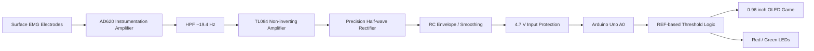

# EMG Biofeedback Rehabilitation Game

> **Surface EMG-based gamified biofeedback system using an analog front-end, Arduino Uno, OLED, and LEDs**

근활성도(EMG)를 실시간으로 측정하고 사용자의 기준 근수축(reference contraction)과 비교하여, OLED 캐릭터가 계단을 오르내리는 형태로 피드백을 제공하는 바이오피드백 시스템입니다. 기존 재활 운동과의 차별을 위해, 단순 수치 표시 대신 **게임형 시각 피드백**을 적용해 사용자가 자신의 근수축 수준을 직관적으로 인지하도록 설계했습니다.

<table>
  <tr>
    <td align="center" width="50%">
      
    </td>
    <td align="center" width="50%">
      
    </td>
  </tr>
  <tr>
    <td align="center"><sub>Perfboard-based analog circuit implementation</sub></td>
    <td align="center"><sub>Integrated system setup with Arduino, OLED, and EMG circuit</sub></td>
  </tr>
</table>

## Project Highlights

- Surface EMG analog front-end 설계 및 만능기판(perfboard) 구현
- AD620 계측증폭기를 이용한 미세 생체신호 증폭
- 약 20 Hz 고역통과필터(HPF)를 이용한 저주파 성분 억제
- TL084 비반전 증폭단을 이용한 추가 증폭
- 정밀 반파 정류 + RC 평활을 통한 EMG envelope 생성
- Zener diode 기반 Arduino A0 입력 과전압 보호
- 사용자별 REF 측정값을 기반으로 한 상대 임계값 설정
- OLED 계단 게임과 Red/Green LED를 이용한 실시간 biofeedback

## System Architecture



## Hardware Design

### 1. EMG front-end and amplification


최종 수정 회로에서는 다음의 신호 경로를 사용했습니다.

- **AD620 instrumentation amplifier**
  - Gain resistor: `5.6 kΩ`
  - 이론적 gain: `1 + 49.4k / 5.6k ≈ 9.82`
- **High-pass filter**
  - `C = 0.1 µF`, `R = 82 kΩ`
  - Cutoff frequency: `fc ≈ 19.4 Hz`
- **TL084 non-inverting amplifier**
  - `Rf = 100 kΩ`, `Rg = 1 kΩ`
  - Gain: `1 + 100k / 1k = 101`
- 전체 nominal voltage gain은 약 `9.82 × 101 ≈ 992 V/V`입니다.

### 2. Rectification, smoothing, and input protection


- TL084 + `1N4148`을 이용한 **precision half-wave rectifier**
- `10 kΩ + 10 µF` RC 평활 회로
  - Time constant: `τ = RC = 0.1 s`
  - Envelope cutoff: `fc ≈ 1.59 Hz`
- `10 kΩ` series resistor와 `1N750` Zener diode를 이용한 Arduino 입력 보호
- 최종 출력은 Arduino Uno의 `A0`로 입력됩니다.

> [!IMPORTANT]
> `hardware/legacy/initial_full_schematic_not_final.jpg`은 **초기 설계안**입니다. 해당 회로에는 여러 설계/연결 오류가 있어 실제 최종 구현의 기준으로 사용하지 않았습니다. 최종 하드웨어는 위의 `frontend_and_amplifier.png`와 `rectifier_and_output.png` 두 수정 회로도를 기준으로 제작했습니다.

### Design Revision

초기 전체 회로에서는 HPF, LPF, buffer, amplifier, rectifier를 각각 독립 블록으로 구성했지만, 회로 검토 과정에서 구성을 수정했습니다. 제공된 최종 수정 회로도 기준으로는 **LPF와 별도 buffer 단을 제거하고**, HPF 이후 TL084 비반전 증폭단으로 연결하는 구조로 단순화했습니다. 이 변경으로 실제 제작 회로와 schematic의 일치성을 높이고 불필요한 회로 복잡도를 줄였습니다.

## Firmware / Biofeedback Logic

Arduino firmware는 `firmware/emg_biofeedback_game.ino`에 있습니다.

### Game Flow

1. 사용자가 기준 근수축을 수행하며 **REF를 3초간 측정**합니다.
2. `threshold = REF × 0.85`로 개인별 목표치를 설정합니다.
3. 총 **6 trials** 동안 매 trial마다 3초간 EMG를 측정합니다.
4. 측정값이 threshold 이상이면 캐릭터가 계단을 한 칸 올라가고 Green LED가 켜집니다.
5. threshold 미만이면 캐릭터가 한 칸 내려가고 Red LED가 켜집니다.
6. 최종 level이 **4 이상이면 WIN**, 그렇지 않으면 LOSE를 표시합니다.

```text
REF measurement (3 s)
        ↓
Threshold = REF × 0.85
        ↓
6 repeated EMG trials
        ↓
EMG ≥ threshold ?
   ├─ Yes → Level +1 / Smile / Green LED
   └─ No  → Level -1 / Neutral / Red LED
        ↓
Final level ≥ 4 ? → WIN : LOSE
```

### EMG Feature Used in the Firmware

각 3초 측정 구간에서 ADC peak를 추적하고, peak의 약 `70–90%` 범위에 들어오는 샘플을 평균하여 trial 대표값을 계산합니다. 유효 샘플이 충분하지 않을 경우 `0.8 × peak`를 fallback 값으로 사용합니다.

이 방식은 절대적인 근전도 크기보다는 **사용자 자신의 REF에 대한 상대적 근활성도**를 게임 판정에 활용하기 위한 간단한 heuristic입니다.

## Pin Configuration

| Component | Arduino Pin |
|---|---|
| EMG analog output | A0 |
| OLED SDA | A4 |
| OLED SCL | A5 |
| Red LED | D7 |
| Green LED | D8 |
| OLED VCC | 5V |
| OLED GND | GND |

OLED I2C address: `0x3C`

## Main Components

| Component | Purpose |
|---|---|
| AD620 | Instrumentation amplifier for EMG acquisition |
| TL084 | Analog amplification and precision rectifier |
| Arduino Uno R3 | ADC acquisition and game logic |
| 0.96" I2C OLED | Visual biofeedback |
| 1N4148 | Precision rectifier diode |
| 1N750 Zener diode | Arduino analog-input protection |
| Perfboard | Final analog circuit implementation |
| Red / Green LEDs | Success / failure feedback |

## Prototype Implementation

<table>
  <tr>
    <td align="center" width="33.3%">
      
    </td>
    <td align="center" width="33.3%">
      
    </td>
    <td align="center" width="33.3%">
      
    </td>
  </tr>
  <tr>
    <td align="center"><sub>Integrated prototype setup</sub></td>
    <td align="center"><sub>Arduino and analog circuit connection</sub></td>
    <td align="center"><sub>Front view of the perfboard implementation</sub></td>
  </tr>
</table>

회로는 breadboard 단계에서 끝내지 않고 만능기판에 직접 구현하여 Arduino 및 OLED와 통합했습니다. Analog signal acquisition, threshold decision, visual feedback을 하나의 prototype으로 연결한 것이 이 프로젝트의 핵심입니다.

## Repository Structure

```text
emg-biofeedback-rehabilitation-game/
├─ README.md
├─ firmware/
│  └─ emg_biofeedback_game.ino
├─ hardware/
│  ├─ final/
│  │  ├─ frontend_and_amplifier.png
│  │  └─ rectifier_and_output.png
│  └─ legacy/
│     └─ initial_full_schematic_not_final.jpg
├─ media/
│  ├─ system_setup_01.jpg
│  ├─ system_setup_02.jpg
│  └─ perfboard_front.jpg
└─ docs/
   ├─ design_notes.md
   └─ bom.md
```

## Engineering Considerations / Limitations

- 현재 알고리즘은 사용자별 REF 대비 상대 threshold를 사용하는 prototype 수준의 방법입니다.
- EMG envelope를 ADC로 읽기 때문에 raw EMG waveform 분석이나 주파수-domain feature extraction은 수행하지 않습니다.
- electrode placement, 피부 접촉 상태, motion artifact에 따라 측정값이 달라질 수 있습니다.
- 향후 RMS/MAV 기반 feature extraction, digital filtering, calibration, multi-channel EMG, trial log 저장 등을 추가할 수 있습니다.
- 본 시스템은 **교육 및 prototype 목적**이며 의료 진단 장비가 아닙니다.
- 인체에 전극을 연결한 상태에서는 배터리 구동 및 적절한 전기적 절연을 우선하고, mains-grounded 장비와의 동시 연결에는 별도의 안전 검토가 필요합니다.

## My Contribution

- Analog EMG front-end circuit design: `TODO`
- Circuit simulation / debugging: `TODO`
- Perfboard soldering and hardware integration: `TODO`
- Arduino firmware and OLED UI: `TODO`
- Experimental verification and demo: `TODO`

## Future Work

- RMS / MAV / integrated EMG 기반 근활성도 계산
- 개인별 calibration protocol 개선
- digital notch filter를 이용한 50/60 Hz power-line noise suppression
- multi-channel EMG acquisition
- trial 결과의 SD card / PC logging
- rehabilitation task별 adaptive difficulty 및 progress tracking

---

### Note for Portfolio Reviewers

This project was developed as a hands-on biomedical instrumentation prototype integrating **analog biosignal acquisition, signal conditioning, embedded programming, and human-centered biofeedback UI** in a single system.
