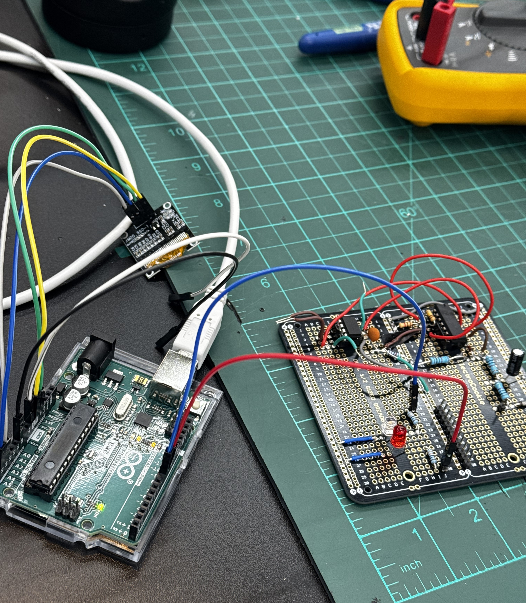
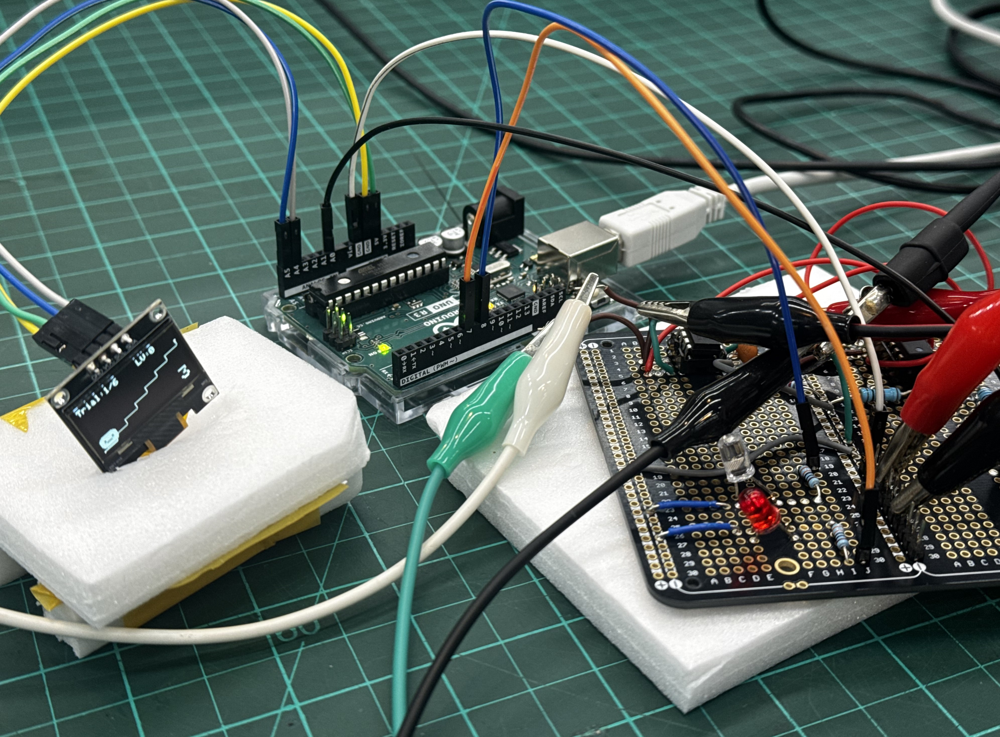
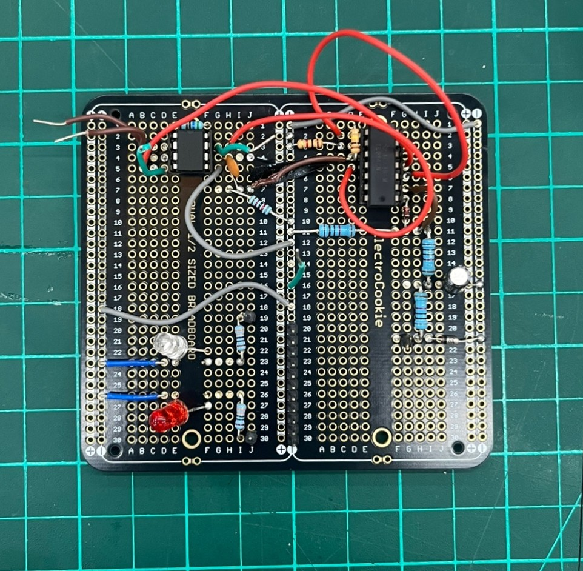
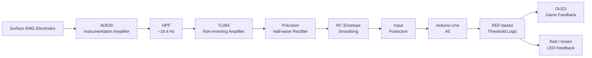
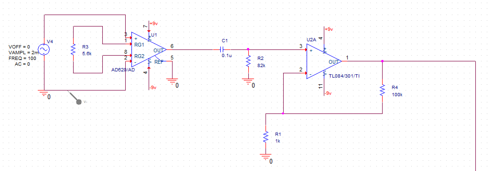
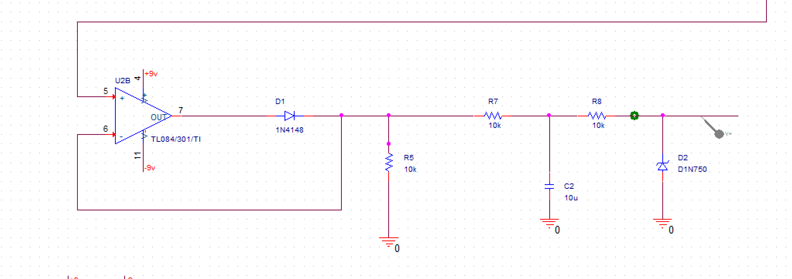
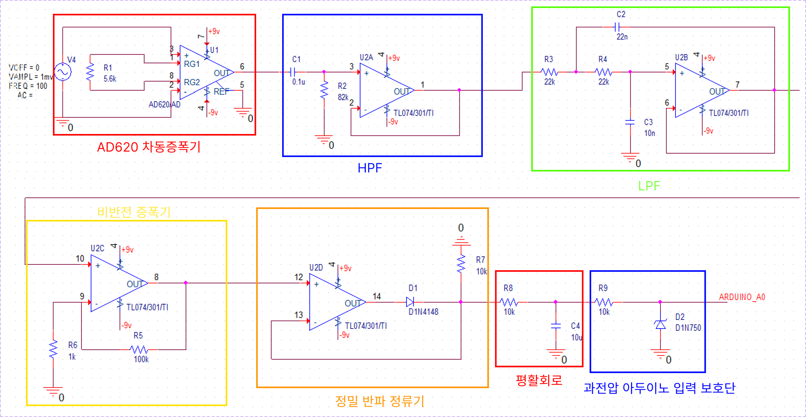
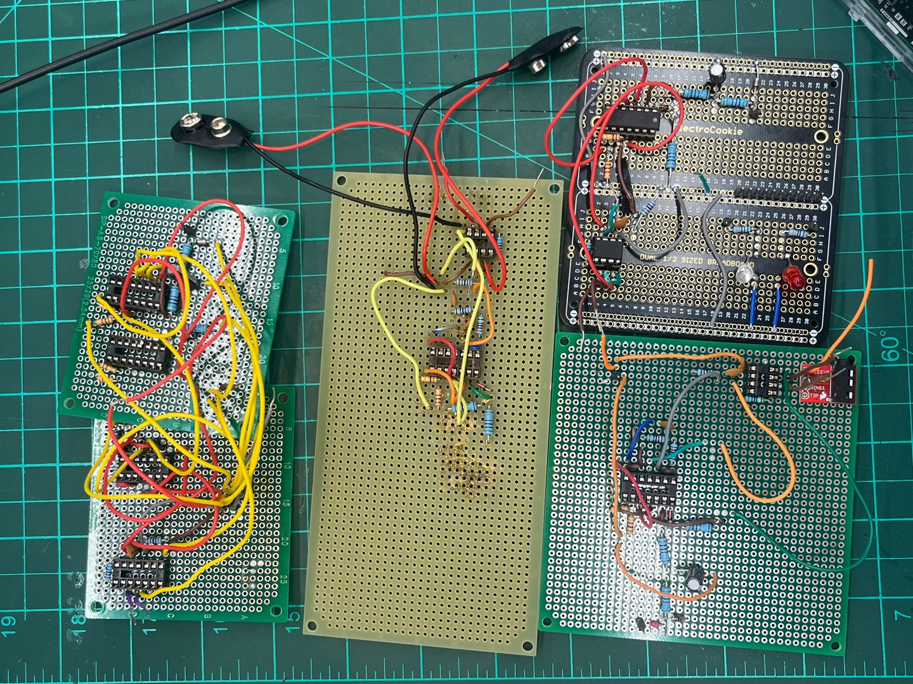

# EMG Biofeedback Rehabilitation Game

> **Surface EMG-based gamified biofeedback system integrating an analog front-end, Arduino Uno, OLED display, and LED feedback**

사용자의 이두박근 근활성도(EMG)를 측정, 사용자의 기준 근수축(reference contraction)과 비교, OLED 캐릭터가 계단을 오르내리는 게임 + LED 불빛으로 피드백을 제공하는 **게임형 EMG biofeedback prototype**입니다.  
기존의 재활운동들과 차별점을 위해, 단순한 수치 표시 대신 시각적 게임 요소를 적용, 사용자가 자신의 근수축 수준을 직관적으로 인지할 수 있도록 설계했습니다.

---

## Prototype Overview

<table>
  <tr>
    <td align="center" width="33.3%">
      
    </td>
    <td align="center" width="33.3%">
      
    </td>
    <td align="center" width="33.3%">
      
    </td>
  </tr>
  <tr>
    <td align="center"><sub>Integrated prototype setup</sub></td>
    <td align="center"><sub>Arduino–OLED–EMG circuit integration</sub></td>
    <td align="center"><sub>Perfboard implementation</sub></td>
  </tr>
</table>

---

## Project Highlights

- **Surface EMG analog front-end** 설계 및 만능기판(perfboard) 실제 구현
- **AD620 instrumentation amplifier**를 이용한 미세 생체신호 증폭
- 약 **19.4 Hz high-pass filter**를 통한 저주파 성분 억제
- **TL084 non-inverting amplifier**를 이용한 추가 증폭
- **Precision half-wave rectification + RC smoothing**을 통한 EMG envelope 생성
- Zener diode 기반 **Arduino A0 input protection**
- 사용자별 REF 측정값 기반의 **relative threshold calibration**
- OLED 계단 게임과 Red/Green LED를 이용한 **real-time biofeedback**

---

## System Architecture



---

# Hardware Design

최종 하드웨어는 아래의 **두 수정 회로도**를 기준으로 제작했습니다.

<table>
  <tr>
    <td align="center" width="50%">
      
    </td>
    <td align="center" width="50%">
      
    </td>
  </tr>
  <tr>
    <td align="center"><sub>① EMG acquisition, HPF, and amplification</sub></td>
    <td align="center"><sub>② Rectification, smoothing, and Arduino input protection</sub></td>
  </tr>
</table>

## 1. EMG Front-end and Amplification

### AD620 Instrumentation Amplifier

Gain resistor:

`RG = 5.6 kΩ`

AD620의 이론적 전압 이득은 다음과 같습니다.

```text
G = 1 + 49.4k / RG
  = 1 + 49.4k / 5.6k
  ≈ 9.82 V/V
```

미세한 differential EMG signal을 1차적으로 증폭하기 위해 사용했습니다.

### High-pass Filter

- `R = 82 kΩ`
- `C = 0.1 µF`

```text
fc = 1 / (2πRC)
   ≈ 19.4 Hz
```

약 20 Hz 이하의 저주파 성분 및 motion artifact의 영향을 줄이기 위한 1차 HPF입니다.

### TL084 Non-inverting Amplifier

- `Rf = 100 kΩ`
- `Rg = 1 kΩ`

```text
G = 1 + Rf/Rg
  = 1 + 100k/1k
  = 101 V/V
```

따라서 AD620과 TL084 증폭단의 nominal voltage gain은:

```text
9.82 × 101 ≈ 992 V/V
```

입니다.

---

## 2. Rectification, Smoothing, and Input Protection

### Precision Half-wave Rectifier

TL084와 `1N4148` diode를 이용하여 증폭된 bipolar EMG signal을 정류했습니다.

### RC Smoothing / Envelope

- `R = 10 kΩ`
- `C = 10 µF`

```text
τ = RC = 0.1 s
```

정류된 EMG 신호를 평활하여 Arduino ADC에서 근활성도의 변화를 비교하기 쉬운 envelope 형태로 입력하도록 구성했습니다.

### Arduino Input Protection

최종 출력단에는:

- `10 kΩ` series resistor
- `1N750` Zener diode

를 배치하여 Arduino Uno의 analog input `A0`에 과도한 전압이 입력되는 것을 제한하도록 구성했습니다.

---

## Design Revision

초기 설계 단계에서는 AD620, HPF, LPF, buffer, amplifier, rectifier 등을 포함한 전체 회로를 구성했습니다. 이후 회로 검토 및 실제 제작 과정에서 연결과 구성상의 문제를 확인하고 회로를 수정했습니다.

최종 구현에서는 **초기 전체 회로도를 그대로 사용하지 않았으며**, 위의 `hardware_final_1.png`과 `hardware_final_2.png`를 기준으로 회로를 제작했습니다.

특히 최종 수정안에서는 별도의 LPF와 buffer 단을 제거하고, 다음과 같이 신호 경로를 단순화했습니다.

```text
Surface EMG
    ↓
AD620 Instrumentation Amplifier
    ↓
High-pass Filter
    ↓
TL084 Non-inverting Amplifier
    ↓
Precision Half-wave Rectifier
    ↓
RC Smoothing
    ↓
Input Protection
    ↓
Arduino A0
```

<details>
<summary><b>Initial schematic (not used as the final implementation reference)</b></summary>
<br>



> **초기 회로 설계안**  
> `hardware_initial.jpg`은 초기 설계 단계에서 작성한 전체 회로도입니다.  
> 이후 실제 회로 검토 및 제작 과정에서 일부 연결과 구성상의 문제를 확인하였으며,
> 최종 prototype은 해당 초기 회로도를 그대로 사용하지 않고
> `hardware_final_1.png`와 `hardware_final_2.png`의 수정 회로를 기준으로 구현했습니다.

</details>

<br>

<details>
<summary><b>Hardware prototyping & debugging iterations</b></summary>
<br>



> **만능기판 구현 및 디버깅 과정**  
> 회로도를 실제 만능기판으로 옮기는 과정에서 여러 차례의 prototype을 제작하고
> 측정 및 debugging을 반복했습니다.
>
> 초기 구현에서는 회로 자체의 동작뿐 아니라 **부품 배치, 배선 복잡도, 납땜 신뢰성,
> 측정 지점 접근성 및 회로 수정의 용이성**과 같은 실제 제작상의 문제도 발생했습니다.
>
> 각 prototype에서 확인된 문제를 바탕으로 부품 배치와 배선을 재구성하고,
> 불필요한 회로 요소를 정리하면서 최종 perfboard 구조를 완성했습니다.
>
> 이 과정은 schematic simulation에서 끝나는 것이 아니라,
> **회로 설계 → 실제 제작 → 측정 → 문제 분석 → 재설계**의 반복적인 hardware debugging 과정으로 진행되었습니다.

</details>
---

# Firmware / Biofeedback Logic

Arduino firmware는 다음 파일에 저장합니다.

```text
firmware/EMG_Biofeedback_game.ino
```

## Game Flow

1. 사용자가 기준 근수축을 수행하며 **REF를 3초간 측정**합니다.
2. 개인별 목표치를 `threshold = REF × 0.85`로 설정합니다.
3. 총 **6 trials** 동안 각 trial마다 3초간 EMG를 측정합니다.
4. 측정값이 threshold 이상이면:
   - Level +1
   - Green LED ON
   - 캐릭터가 계단을 한 칸 올라감
   - 웃는 표정으로 변경
5. threshold 미만이면:
   - Level -1
   - Red LED ON
   - 캐릭터가 계단을 한 칸 내려감
   - 무표정으로 변경
6. 6회의 trial 종료 후 최종 level이 **4 이상이면 WIN**, 그렇지 않으면 **LOSE**를 표시합니다.

```text
REF measurement (3 s)
        ↓
Threshold = REF × 0.85
        ↓
6 repeated EMG trials
        ↓
EMG ≥ threshold ?
   ├─ YES → Level +1 / Smile / Green LED
   └─ NO  → Level -1 / Neutral / Red LED
        ↓
Final Level ≥ 4 ?
   ├─ YES → WIN
   └─ NO  → LOSE
```

---

## EMG Feature Used in the Firmware

각 3초 측정 구간에서 Arduino ADC 값을 반복적으로 읽으면서 peak를 추적합니다.

현재 firmware에서는 peak의 약 `70–90%` 범위에 위치한 sample들을 평균하여 각 trial의 대표값으로 사용합니다.

```cpp
if (v >= peak * 0.70 && v <= peak * 0.90) {
    sumBand += v;
    cntBand++;
}
```

유효 sample이 충분하지 않은 경우에는 다음 값을 fallback으로 사용합니다.

```cpp
return peak * 0.80;
```

이 방식은 정식 임상 EMG normalization 기법이라기보다, **사용자 자신의 REF 대비 상대적인 근활성도 변화를 게임 판정에 활용하기 위한 prototype-level heuristic**입니다.

---

# Demo Videos

실제 EMG 신호 측정과 최종 시스템 동작은 아래 영상에서 확인할 수 있습니다.

### 1. EMG Signal Observation

근수축 시 발생하는 surface EMG signal을 오실로스코프로 관측한 짧은 영상입니다.

▶ **[Watch EMG oscilloscope output](media/videos/emg%20출력.mp4)**

### 2. 1-Minute Project Summary

회로 구현부터 OLED 기반 biofeedback game 동작까지 전체 프로젝트를 약 1분으로 정리한 영상입니다.

▶ **[Watch 1-minute project summary](media/videos/emg%20쇼츠.mp4)**

---

# Pin Configuration

| Component | Arduino Pin |
|---|---:|
| EMG analog output | `A0` |
| OLED SDA | `A4` |
| OLED SCL | `A5` |
| Red LED | `D7` |
| Green LED | `D8` |
| OLED VCC | `5V` |
| OLED GND | `GND` |

OLED I2C address: `0x3C`

---

# Main Components

| Component | Purpose |
|---|---|
| AD620 | Instrumentation amplifier for EMG acquisition |
| TL084 | Analog amplification and precision rectification |
| Arduino Uno R3 | ADC acquisition and biofeedback game logic |
| 0.96" I2C OLED | Visual biofeedback |
| 1N4148 | Rectifier diode |
| 1N750 Zener diode | Arduino analog-input protection |
| Perfboard | Final analog circuit implementation |
| Red / Green LEDs | Success / failure feedback |

---

# Prototype Implementation

<table>
  <tr>
    <td align="center" width="33.3%">
      
    </td>
    <td align="center" width="33.3%">
      
    </td>
    <td align="center" width="33.3%">
      
    </td>
  </tr>
  <tr>
    <td align="center"><sub>Hardware integration</sub></td>
    <td align="center"><sub>OLED biofeedback game test</sub></td>
    <td align="center"><sub>Final perfboard circuit</sub></td>
  </tr>
</table>

회로를 breadboard 단계에서 끝내지 않고 **perfboard에 직접 구현**하고 Arduino Uno 및 OLED display와 통합했습니다.

이를 통해:

```text
Biosignal acquisition
        ↓
Analog signal conditioning
        ↓
ADC acquisition
        ↓
Threshold decision
        ↓
Visual / LED biofeedback
```

과정을 하나의 prototype으로 연결했습니다.

---

# Repository Structure

```text
emg-biofeedback-rehabilitation-game/
│
├── README.md
│
├── firmware/
│   └── EMG_Biofeedback_game.ino
│
├── hardware/
│   ├── final/
│   │   ├── hardware_final_1.png
│   │   └── hardware_final_2.png
│   │
│   └── legacy/
│       └── hardware_initial.jpg
│
└── media/
    ├── system_setup_01.jpg
    ├── system_setup_02.jpg
    └── Final_perfboard.jpg 
```

> 파일명은 실제 업로드한 원본 파일명을 그대로 사용합니다.

---

# Engineering Considerations / Limitations

- 현재 알고리즘은 사용자별 REF 대비 상대 threshold를 이용하는 **prototype-level method**입니다.
- EMG envelope를 Arduino ADC로 입력하므로 raw EMG waveform에 대한 frequency-domain feature extraction은 수행하지 않습니다.
- electrode placement, 피부 접촉 상태 및 motion artifact에 따라 측정값이 달라질 수 있습니다.
- 현재 시스템은 single-channel EMG 기반입니다.
- 인체 전극을 사용하는 실험에서는 전원 및 측정 장비의 전기적 안전과 절연 조건을 우선적으로 고려해야 합니다.

---

# Future Work

- RMS / MAV / integrated EMG 기반 근활성도 feature extraction
- 개인별 calibration protocol 개선
- 50/60 Hz power-line noise suppression
- multi-channel EMG acquisition
- trial 결과의 PC / SD card logging
- rehabilitation task별 adaptive difficulty
- 반복 세션 기반 progress tracking

---

## Portfolio Summary

This project demonstrates a complete biomedical engineering workflow integrating:

**surface EMG acquisition → analog signal conditioning → embedded processing → human-centered biofeedback interface**

into a single working prototype.

The project also involved an iterative hardware design process in which the initial schematic was reviewed, revised, and implemented as a corrected final circuit.
